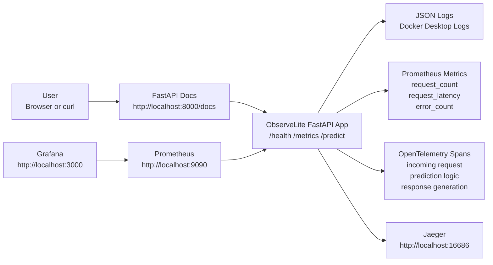

# ObserveLite

ObserveLite is a small observability demo application. It shows how a Python API can be monitored, traced, logged, and visualized without Kubernetes, cloud infrastructure, Terraform, Loki, service meshes, or eBPF.

The project is built for learning and portfolio use. A newcomer should be able to run it on a laptop, call one API endpoint, and then see the result appear in logs, metrics, dashboards, and traces.

## What It Does

ObserveLite runs a FastAPI service with three endpoints:

| Endpoint | Method | Purpose |
| --- | --- | --- |
| `/health` | `GET` | Confirms the service is alive |
| `/metrics` | `GET` | Exposes Prometheus metrics |
| `/predict` | `POST` | Runs a tiny sentiment prediction |

The `/predict` endpoint accepts text and returns whether the text looks `positive`, `negative`, or `neutral`.

Example request:

```json
{
  "text": "This observability demo is great and reliable."
}
```

Example response:

```json
{
  "sentiment": "positive",
  "confidence": 0.9,
  "input_length": 46
}
```

The prediction logic is intentionally rule-based instead of using a large machine learning model. That keeps the project fast, cheap, and laptop-friendly while still producing real application traffic to observe.

## What You Are Observing

When you call `/predict`, ObserveLite lets you inspect the same request in four different ways:

| Tool | What It Shows | Question It Answers |
| --- | --- | --- |
| FastAPI docs | The API request and response | Did the endpoint work? |
| Docker logs | Structured JSON application events | What did the app record? |
| Prometheus and Grafana | Metrics over time | How many requests, how fast, how many errors? |
| Jaeger | Distributed traces and spans | What happened inside one request? |

In real systems, these are the basic pillars of observability:

- logs tell you what events happened
- metrics tell you what is happening over time
- traces tell you where one request spent its time

## Architecture



## Services

Docker Compose starts four services:

| Service | Container | What It Does | URL |
| --- | --- | --- | --- |
| App | `observelite-app` | Runs the FastAPI application | http://localhost:8000 |
| Prometheus | `observelite-prometheus` | Scrapes `/metrics` from the app | http://localhost:9090 |
| Grafana | `observelite-grafana` | Displays a dashboard from Prometheus data | http://localhost:3000 |
| Jaeger | `observelite-jaeger` | Receives and displays OpenTelemetry traces | http://localhost:16686 |

Grafana login:

```text
username: admin
password: admin
```

## Why Each Part Exists

### FastAPI

FastAPI is the Python web framework. It exposes the API endpoints and automatically provides interactive documentation at `/docs`.

### Prometheus

Prometheus collects numeric time-series data from the app. It scrapes:

```text
http://app:8000/metrics
```

The app exposes custom metrics such as request count, request latency, and error count.

### Grafana

Grafana reads data from Prometheus and turns it into charts. The dashboard is already provisioned, so it appears automatically when Grafana starts.

### OpenTelemetry

OpenTelemetry creates traces and spans inside the application. A span is one timed piece of work, such as:

```text
incoming request
prediction logic
response generation
```

### Jaeger

Jaeger receives traces from OpenTelemetry and gives you a UI to inspect individual requests.

### Docker Compose

Docker Compose runs the whole mini-system locally. You do not need Kubernetes or cloud services.

## Requirements

Install:

- Docker
- Docker Compose

This project targets:

- Python 3.12
- FastAPI
- Prometheus
- Grafana
- OpenTelemetry
- Jaeger

You do not need to install Python locally if you only run the Docker Compose setup.

## How To Run

From the project directory:

```bash
cd /Users/sauravghoshal/Documents/Codex/2026-06-21/build-a-complete-but-lightweight-portfolio-2/observelite
```

Start everything:

```bash
docker compose up --build
```

If your system uses the older Compose command, run:

```bash
docker-compose up --build
```

Wait until the containers are running. Then open:

| Page | URL |
| --- | --- |
| FastAPI docs | http://localhost:8000/docs |
| Prometheus | http://localhost:9090 |
| Grafana | http://localhost:3000 |
| Jaeger | http://localhost:16686 |

Stop everything:

```bash
docker compose down
```

Or, with legacy Compose:

```bash
docker-compose down
```

## First Demo Flow

Use this flow when showing the project to someone new.

### 1. Open The API Docs

Go to:

```text
http://localhost:8000/docs
```

You should see Swagger UI with:

- `GET /health`
- `GET /metrics`
- `POST /predict`

### 2. Check Health

Open `GET /health`, click **Try it out**, then click **Execute**.

Expected result:

```json
{
  "status": "ok",
  "service": "ObserveLite"
}
```

This proves the API is running.

### 3. Call Prediction

Open `POST /predict`, click **Try it out**, and use:

```json
{
  "text": "This app is great and reliable."
}
```

Click **Execute**.

Expected result:

```json
{
  "sentiment": "positive",
  "confidence": 0.9,
  "input_length": 31
}
```

The exact confidence may change if you use different words.

### 4. Check Logs

In Docker Desktop:

1. Open **Containers**
2. Click the `observelite-app` container
3. Open **Logs**
4. Search for `/predict`

You should see JSON logs similar to:

```json
{
  "timestamp": "2026-06-21T17:49:23.298973+00:00",
  "level": "INFO",
  "logger": "observelite",
  "message": "request completed",
  "method": "POST",
  "endpoint": "/predict",
  "http_status": 200,
  "latency_seconds": 0.008472
}
```

What this means:

- `method` is the HTTP method
- `endpoint` is the route that was called
- `http_status` is whether it succeeded
- `latency_seconds` is how long it took

You will also see many `/health` logs because Docker checks the app health every 30 seconds.

### 5. Check Metrics In Prometheus

Open:

```text
http://localhost:9090
```

Try these queries:

```promql
request_count_total
```

Shows how many requests the app handled.

```promql
sum(rate(request_count_total[1m]))
```

Shows requests per second.

```promql
request_latency_bucket
```

Shows latency histogram buckets.

```promql
sum(error_count_total)
```

Shows total application errors.

Important: Prometheus counters automatically appear with `_total` at the end. The app defines `request_count`, but Prometheus exposes it as `request_count_total`.

### 6. Check The Grafana Dashboard

Open:

```text
http://localhost:3000
```

Log in:

```text
admin / admin
```

Go to:

```text
Dashboards -> ObserveLite -> ObserveLite Overview
```

You should see:

- total requests
- request latency p95
- error count
- requests per second
- latency by endpoint
- request rate by endpoint and status

If the graphs look empty, call `/predict` a few more times and wait 5-10 seconds.

### 7. Check Traces In Jaeger

Open:

```text
http://localhost:16686
```

Then:

1. Select service `observelite-app`
2. Leave operation as `all`, or choose `POST /predict` if it appears
3. Set lookback to `Last 15 minutes`
4. Click **Find Traces**
5. Open one trace

For a `/predict` request, you should see spans like:

```text
incoming request
prediction logic
response generation
```

What this means:

- `incoming request` is the app receiving the HTTP request
- `prediction logic` is the sentiment calculation
- `response generation` is the app building the response

This is how tracing helps you understand where time was spent inside one request.

## API Reference

### `GET /health`

Returns:

```json
{
  "status": "ok",
  "service": "ObserveLite"
}
```

Use it to confirm that the service is alive.

### `GET /metrics`

Returns Prometheus metrics in text format.

You normally do not read this page manually. Prometheus scrapes it automatically.

### `POST /predict`

Request body:

```json
{
  "text": "This app is great."
}
```

Response body:

```json
{
  "sentiment": "positive",
  "confidence": 0.9,
  "input_length": 18
}
```

The sentiment can be:

- `positive`
- `negative`
- `neutral`

## Metrics Explained

ObserveLite exposes these custom metric families:

| Metric | Type | Labels | Meaning |
| --- | --- | --- | --- |
| `request_count` | Counter | `method`, `endpoint`, `http_status` | Total number of handled requests |
| `request_latency` | Histogram | `method`, `endpoint` | Request duration in seconds |
| `error_count` | Counter | `method`, `endpoint`, `http_status` | Number of 5xx errors or exceptions |

Common PromQL:

```promql
sum(request_count_total)
```

Total requests.

```promql
sum(rate(request_count_total[1m]))
```

Requests per second over the last minute.

```promql
histogram_quantile(0.95, sum(rate(request_latency_bucket[1m])) by (le))
```

95th percentile request latency.

```promql
sum(error_count_total)
```

Total errors.

## Tracing Explained

A trace represents one request moving through the application.

A span is one timed operation inside that trace.

For `/predict`, ObserveLite creates spans for:

| Span | Meaning |
| --- | --- |
| `incoming request` | The app received and handled the HTTP request |
| `prediction logic` | The sentiment analysis logic ran |
| `response generation` | The response object was created |

OpenTelemetry creates the spans. Jaeger displays them.

This helps answer questions like:

- Did the request reach the app?
- Which part of the request took the longest?
- Did the prediction logic run?
- Did the app return successfully?

## Logging Explained

The app writes structured JSON logs to stdout. Docker captures those logs, so you can view them in Docker Desktop or with:

```bash
docker compose logs -f app
```

Legacy Compose:

```bash
docker-compose logs -f app
```

The app logs:

- request received
- request completed
- exceptions
- latency
- HTTP method
- endpoint
- status code

Logs are useful when you want exact event records. Metrics are better for trends. Traces are better for following one request.

## Expected Result

After the project is running and you call `/predict`, you should be able to prove all of this:

| Check | Expected Result |
| --- | --- |
| FastAPI docs | `/predict` returns a sentiment response |
| Docker logs | JSON log lines show `POST /predict` |
| Prometheus | `request_count_total` increases |
| Grafana | dashboard panels show request activity |
| Jaeger | traces show `/predict` spans |

That is the full observability loop.

## Local Development Without Docker

Use Python 3.12.

```bash
python -m venv .venv
source .venv/bin/activate
pip install -r requirements.txt
ENABLE_TRACING=false uvicorn app.main:app --reload
```

Open:

```text
http://localhost:8000/docs
```

Run tests:

```bash
ENABLE_TRACING=false pytest
```

## Project Structure

```text
observelite/
├── app/
│   ├── __init__.py
│   ├── config.py
│   ├── logging_config.py
│   ├── main.py
│   ├── metrics.py
│   ├── predictor.py
│   ├── schemas.py
│   └── tracing.py
├── monitoring/
│   ├── grafana/
│   │   ├── dashboards/
│   │   │   └── observelite.json
│   │   └── provisioning/
│   └── prometheus.yml
├── tests/
│   └── test_api.py
├── docs/
│   └── screenshots/
├── docker-compose.yml
├── Dockerfile
├── pyproject.toml
├── requirements.txt
└── README.md
```

## Screenshots

- `docs/screenshots/docker-logs.png`
- `docs/screenshots/prometheus-query.png`
- `docs/screenshots/grafana-dashboard.png`


## Troubleshooting

### Docker Desktop only shows `http://localhost:8000`

That is normal. Docker Desktop shows the base port only. Manually open:

```text
http://localhost:8000/docs
```

### I only see `/health` in logs

Docker calls `/health` automatically because the app has a health check. Call `/predict` from FastAPI docs again, then search the app logs for:

```text
/predict
```

### I do not see traces in Jaeger

Call `/predict` again, wait a few seconds, then search in Jaeger with:

```text
service: observelite-app
lookback: Last 15 minutes
operation: all
```

### Grafana is empty

Prometheus scrapes every 5 seconds. Call `/predict` a few times, wait 5-10 seconds, then refresh Grafana.

### `docker compose` does not work

Try the legacy command:

```bash
docker-compose up --build
```

## Design Choices

- Rule-based sentiment keeps memory and disk usage low.
- Docker Compose keeps the system easy to run locally.
- Prometheus retention is capped to reduce disk usage.
- JSON logs are written to stdout, which is container-friendly.
- OpenTelemetry exports traces to Jaeger using OTLP.
- The project avoids Kubernetes, Terraform, Loki, service meshes, and eBPF on purpose.

## Portfolio Summary

ObserveLite is a lightweight observability playground. It demonstrates how a production-style Python service can expose health checks, metrics, logs, traces, dashboards, and tests while staying small enough to run on a normal laptop.
